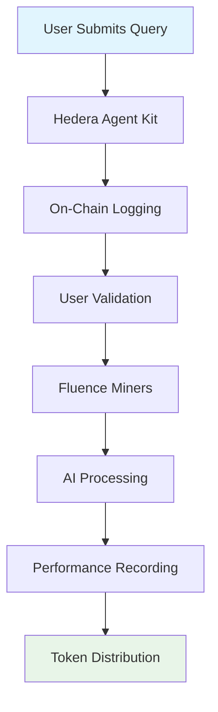

# TensorNode

## Bittensor on Hedera

> **Deployed site has 4 nodes live, Dont try to deploy more as i am low on credits**
> 
> **Decentralized AI with verifiable fairness on Hedera + Fluence**

## Important Details

MASTER_SCORE_TOPIC=0.0.6916998
VALIDATOR_REGISTRY=0.0.6917106
HEDERA_OPERATOR_KEY=ecdsa
ACCOUNT_ID=0.0.5877428
NEXT_PUBLIC_INSTANCE_REGISTRY_CONTRACT_ID=0.0.6915896

TensorNode is a revolutionary decentralized AI infrastructure platform that democratizes access to artificial intelligence through a novel "Proof of Intelligence" consensus mechanism. Built on Hedera's ultra-efficient blockchain and Fluence's peer-to-peer compute fabric, TensorNode creates a fair, transparent, and accessible AI marketplace where every user validates and real performance is rewarded.

[](https://opensource.org/licenses/MIT) [](https://nodejs.org/) [](https://python.org/) [](https://hedera.com/) [](https://fluence.network/)

## 🌟 The Vision

**A universal, community-owned AI marketplace where consensus is Proof of Intelligence** — miners are rewarded for real performance, validators are every user, and decentralized AI is accessible to everyone, everywhere.

## 🚀 Why TensorNode?

### The Problem with Current AI Infrastructure

| Issue                      | Traditional Systems                                | TensorNode Solution                   |
| -------------------------- | -------------------------------------------------- | ------------------------------------- |
| **High Barrier to Entry**  | Running a Bittensor subnet costs \~$150K           | Accessible deployment on Hedera       |
| **Centralized Validators** | Few privileged validators create bottlenecks       | Every user validates democratically   |
| **Weight Copying Rewards** | Systems reward copying instead of intelligence     | Performance-based rewards for real AI |
| **No Verification**        | Users can't verify if miners were actually queried | Complete on-chain transparency        |

### Our Revolutionary Approach

🏛️ **Every User Validates** - No privileged roles, democratized validation process\
🔗 **On-Chain Registry** - Hedera Agent Kit logs all queries for complete verifiability\
⚡ **Fluence Miners** - Standardized, lightweight P2P execution environment\
🏆 **Performance Rewards** - Miners ranked by accuracy + response time, not copied weights

## 🏗️ Architecture

TensorNode combines three powerful technologies:

### 🔷 Hedera Hashgraph

* **Ultra-Low Fees**: Queries and validations affordable at scale
* **High Throughput**: Supports AI inference at real-world volumes
* **Energy Efficient**: Green AI validation layer
* **Agent Kit**: Seamless and verifiable validation integration

### 🌐 Fluence Network

* **P2P Compute Fabric**: Lightweight miner orchestration without centralized control
* **Deterministic Execution**: Ensures fair, reproducible outputs
* **Global Accessibility**: Anyone can run a miner anywhere

### 🧠 Proof of Intelligence

* **Real Performance Metrics**: Accuracy and response time scoring
* **Transparent Validation**: Every query logged on-chain
* **Fair Rewards**: Token distribution based on actual intelligence

## 📊 System Flow



1. **Query Submission** - User submits query via Hedera Agent Kit
2. **On-Chain Logging** - Query logged on Hedera Topics for transparency
3. **User Validation** - Every user acts as validator, confirms query validity
4. **Miner Processing** - Fluence miners process requests and return responses
5. **Performance Recording** - Response time and accuracy scores recorded on-chain
6. **Token Distribution** - Daily minting distributes tokens by consensus

## 💰 Tokenomics

### Daily Mint Distribution

* **7,200 tokens daily** (\~1 token every 12 seconds)
* **Performance-based allocation** to miners and validators
* **Transparent distribution** recorded on Hedera

### Revenue Streams

* Transaction fees
* Subnet registration
* Premium tools
* Enterprise partnerships

## 🚀 Quick Start

### Prerequisites

* Node.js 20+
* Python 3.9+
* Docker
* Hedera testnet account

### Installation

```bash
# Clone the repository
git clone https://github.com/philotheephilix/tensornode.git
cd tensornode

# Install frontend dependencies
cd nextjs
npm install
cp .env.local.example .env.local
# Edit .env.local with your configuration

# Install backend dependencies
cd ../backend
python -m venv venv
source venv/bin/activate  # On Windows: venv\Scripts\activate
pip install flask flask-cors requests python-dotenv

# Start services
# Terminal 1: Backend
cd backend && python server.py

# Terminal 2: Frontend  
cd nextjs && npm run dev
```

Visit `http://localhost:3000` to access the TensorNode interface.

## 🎯 Getting Started

### For Miners

1. **Deploy AI Models** on Fluence VMs
2. **Earn Rewards** based on performance metrics
3. **Scale Globally** with P2P infrastructure

### For Validators

1. **Submit Queries** to test network quality
2. **Score Responses** automatically
3. **Earn Tokens** for validation work

### For Developers

1. **Integrate APIs** for AI capabilities
2. **Build Applications** on decentralized infrastructure
3. **Contribute** to the open-source ecosystem

## 📁 Repository Structure

```
tensornode/
├── nextjs/                 # Frontend (Next.js 15 + React 19)
│   ├── src/app/            # App router pages
│   ├── src/components/     # Reusable components
│   ├── src/lib/           # Utilities and configurations
│   └── src/types/         # TypeScript definitions
├── backend/               # Backend (Python Flask)
│   ├── server.py          # Main API server
│   ├── fluence/           # VM management
│   └── utils/             # Helper utilities
├── hedera-contracts/      # Smart contracts (Solidity)
│   ├── contracts/         # Contract source code
│   ├── scripts/           # Deployment scripts
│   └── test/              # Contract tests
└── docs/                  # Comprehensive documentation
    ├── README.md          # Documentation homepage
    ├── quick-start.md     # Quick start guide
    ├── api/               # API documentation
    ├── guides/            # User guides
    └── architecture/      # Technical documentation
```

## 🛠️ Technology Stack

### Frontend

* **Next.js 15** with App Router
* **React 19** with concurrent features
* **TypeScript** for type safety
* **Tailwind CSS** + shadcn/ui components
* **Hedera Wallet Connect** integration

### Backend

* **Python Flask** API server
* **Fluence SDK** for VM management
* **OpenAI/Anthropic** for AI scoring
* **Redis** for caching
* **PostgreSQL** for data persistence

### Blockchain

* **Hedera Hashgraph** for consensus
* **Solidity** smart contracts
* **Hedera Agent Kit** for AI integration
* **HCS Topics** for messaging

### Infrastructure

* **Fluence VMs** for decentralized compute
* **Docker** containerization
* **NGINX** load balancing
* **Prometheus/Grafana** monitoring

## 📈 Competitive Advantage

### vs. Bittensor

* ✅ **$150K subnet cost** → **<$1K on Hedera**
* ✅ **Few validators** → **Every user validates**
* ✅ **Weight copying** → **Proof of Intelligence**

### vs. Centralized AI

* ✅ **No gatekeepers** - Open participation
* ✅ **Fully transparent** - All queries on-chain
* ✅ **Verifiable participation** - Cryptographic proof

## 🌍 Market Opportunity

**$100B+ Market Size** - Decentralized AI infrastructure projected by 2030

Hedera's EVM + Fluence P2P compute unlocks global access to democratized AI with thousands of subnets and millions of participants.

## 📚 Documentation

Comprehensive documentation is available in the `/docs` directory:

* [**Quick Start Guide**](docs/quick-start.md) - Get up and running in 10 minutes
* [**Installation Guide**](docs/installation.md) - Detailed setup instructions
* [**API Reference**](docs/api/rest-api.md) - Complete API documentation
* [**Miner Guide**](docs/guides/miner.md) - How to run AI miners
* [**Architecture Overview**](docs/architecture/system-overview.md) - Technical deep dive
* [**Smart Contracts**](docs/contracts/) - Contract documentation
* [**Deployment Guide**](docs/development/deployment.md) - Production deployment

## 🤝 Contributing

We welcome contributions from the community! Please see our [Contributing Guide](docs/development/contributing.md) for details on:

* Code style and standards
* Pull request process
* Issue reporting
* Development setup

### Development Setup

```bash
# Fork and clone the repository
git clone https://github.com/your-username/tensornode.git
cd tensornode

# Create a feature branch
git checkout -b feature/your-feature-name

# Make your changes and test
npm test  # Frontend tests
python -m pytest  # Backend tests

# Submit a pull request
```

## 🔒 Security

TensorNode takes security seriously:

* **Cryptographic Verification** - All transactions signed
* **Isolated Execution** - AI models run in sandboxed containers
* **Access Control** - Role-based permissions
* **Audit Trails** - Immutable record of all activities

For security issues, please email security@tensornode.com

## 📄 License

This project is licensed under the MIT License - see the [LICENSE](LICENSE/) file for details.

## 🌐 Community & Support

* **Website**: [tensornode.com](https://tensornode.com)
* **Documentation**: [docs.tensornode.com](https://docs.tensornode.com)
* **Discord**: [Join our community](https://discord.gg/tensornode)
* **Twitter**: [@TensorNode](https://twitter.com/tensornode)
* **Telegram**: [t.me/tensornode](https://t.me/tensornode)
* **GitHub Issues**: [Report bugs](https://github.com/your-org/tensornode/issues)

## 🙏 Acknowledgments

* **Hedera Team** for the ultra-efficient blockchain infrastructure
* **Fluence Network** for decentralized compute capabilities
* **Open Source Community** for the foundational technologies
* **Early Contributors** who helped shape TensorNode

***

**Join the AI Revolution** 🚀

TensorNode is more than just a platform—it's a movement towards democratized, transparent, and fair artificial intelligence. Together, we're building the future of decentralized AI infrastructure.

_Made with ❤️ by the TensorNode community_
