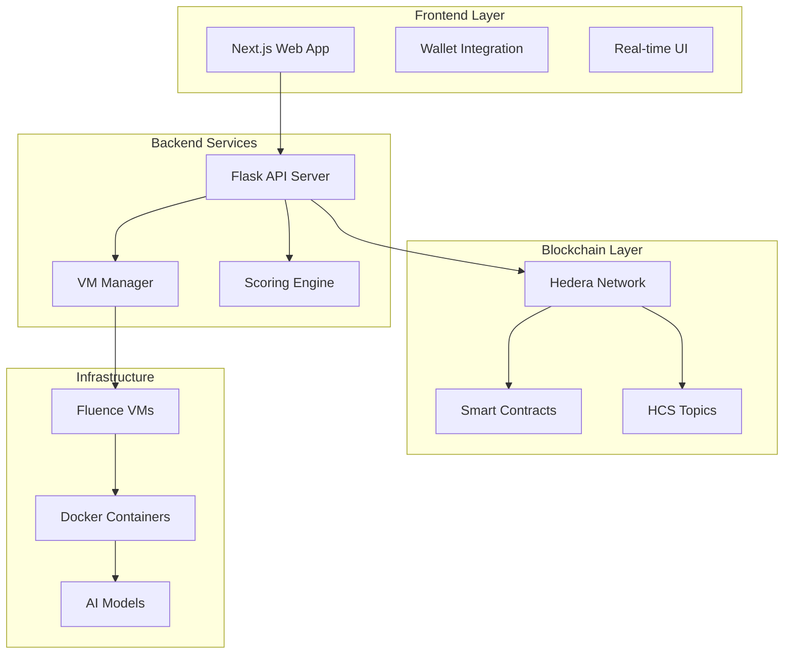

# TensorNode Documentation

Welcome to the comprehensive documentation for **TensorNode** - a decentralized network of AI-powered nodes that provide distributed computing services through the Hedera blockchain ecosystem.

## 📚 Table of Contents

### Getting Started
- [Overview](overview.md) - Introduction to TensorNode architecture
- [Quick Start](quick-start.md) - Get up and running in minutes
- [Installation](installation.md) - Detailed setup instructions

### Architecture
- [System Architecture](architecture/system-overview.md) - High-level system design
- [Network Components](architecture/components.md) - Core system components
- [Data Flow](architecture/data-flow.md) - How data moves through the system
- [Security Model](architecture/security.md) - Security considerations and implementation

### Core Components
- [Frontend Application](frontend/README.md) - Next.js web interface
- [Backend Services](backend/README.md) - Python Flask API server
- [Smart Contracts](contracts/README.md) - Hedera smart contracts
- [VM Management](vm-management/README.md) - Fluence VM orchestration

### User Guides
- [Miner Guide](guides/miner.md) - How to run a miner node
- [Validator Guide](guides/validator.md) - How to validate network responses
- [Subnet Management](guides/subnet.md) - Managing network subnets

### API Reference
- [REST API](api/rest-api.md) - Backend API endpoints
- [Smart Contract API](api/smart-contracts.md) - Contract interfaces
- [WebSocket API](api/websocket.md) - Real-time communication

### Development
- [Development Setup](development/setup.md) - Local development environment
- [Contributing](development/contributing.md) - How to contribute
- [Testing](development/testing.md) - Testing strategies and tools
- [Deployment](development/deployment.md) - Production deployment guide

### Advanced Topics
- [Custom Subnets](advanced/custom-subnets.md) - Creating specialized networks
- [Performance Optimization](advanced/performance.md) - Optimizing node performance
- [Monitoring](advanced/monitoring.md) - System monitoring and observability
- [Troubleshooting](advanced/troubleshooting.md) - Common issues and solutions

## 🚀 What is TensorNode?

TensorNode is a decentralized AI infrastructure platform that enables:

- **Distributed AI Computing**: Run AI models across a network of decentralized nodes
- **Blockchain Integration**: Leverage Hedera's consensus and smart contract capabilities
- **Incentive Mechanisms**: Token-based rewards for network participants
- **Scalable Architecture**: Dynamic scaling through VM orchestration
- **Multi-Modal AI**: Support for LLM, vision, speech, and translation models

## 🏗️ Architecture Overview

## 🌟 Key Features

### For Miners
- Deploy AI models on decentralized VMs
- Earn rewards for providing compute resources
- Automatic scaling and load balancing
- Docker-based deployment for flexibility

### For Validators
- Submit queries to test network quality
- Score miner responses automatically
- Participate in network governance
- Real-time performance monitoring

### For Developers
- REST API for easy integration
- WebSocket support for real-time features
- Smart contract interfaces
- Comprehensive SDK and tools

## 🔗 Quick Links

- **Live Demo**: [TensorNode App](https://tensornode.example.com)
- **GitHub Repository**: [tensornode](https://github.com/your-org/tensornode)
- **API Documentation**: [REST API Reference](api/rest-api.md)
- **Smart Contracts**: [Contract Documentation](contracts/README.md)
- **Community**: [Discord](https://discord.gg/tensornode) | [Telegram](https://t.me/tensornode)

## 📖 Documentation Structure

This documentation is organized into several main sections:

1. **Getting Started** - Everything you need to begin using TensorNode
2. **Architecture** - Deep dive into system design and components
3. **User Guides** - Step-by-step instructions for different user roles
4. **API Reference** - Complete API documentation
5. **Development** - Resources for contributors and developers
6. **Advanced Topics** - Complex configurations and optimizations

## 🤝 Contributing

We welcome contributions to both the codebase and documentation! Please see our [Contributing Guide](development/contributing.md) for details on:

- Code style and standards
- Pull request process
- Issue reporting
- Documentation improvements

## 📄 License

TensorNode is released under the [MIT License](../LICENSE).

---

*Last updated: $(date)*
*Version: 1.0.0*
