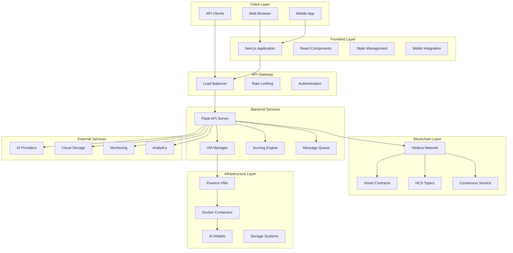
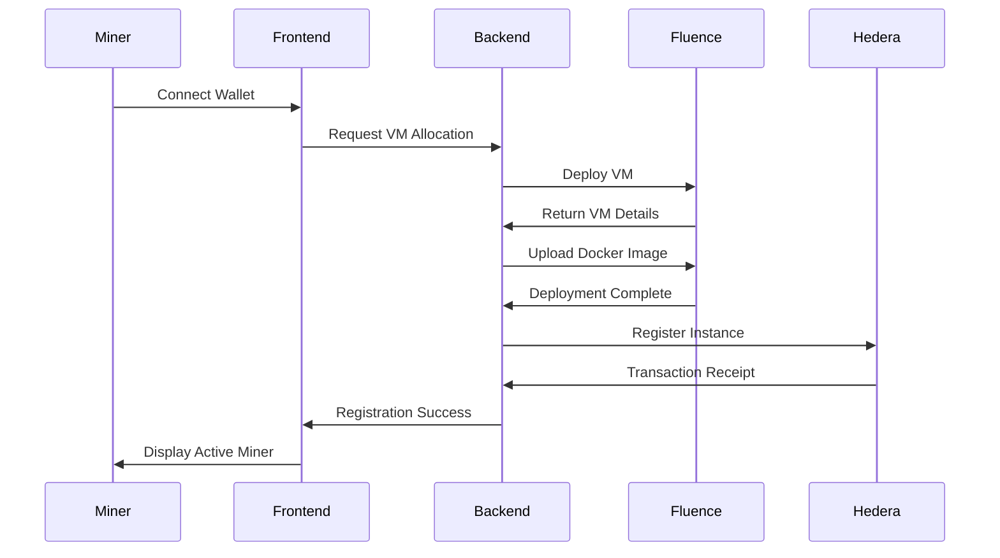
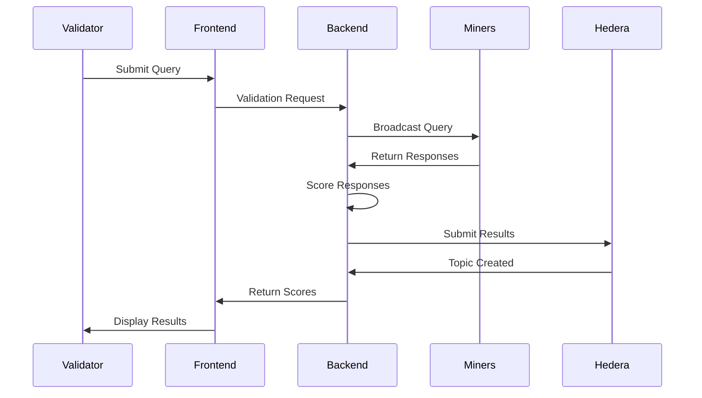
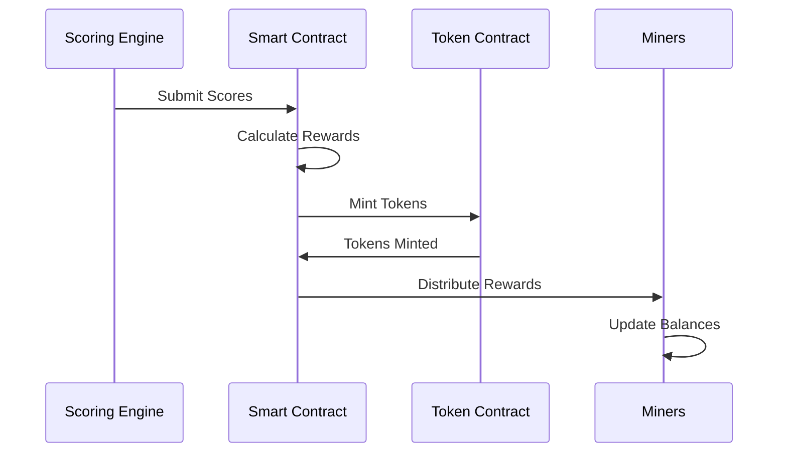

# System Architecture Overview

TensorNode is built as a multi-layered, distributed system that combines modern web technologies with blockchain infrastructure and decentralized computing resources. This document provides a comprehensive overview of the system architecture, component interactions, and design decisions.

## High-Level Architecture



## Architecture Principles

### 1. Decentralization
- **No Single Point of Failure**: Distributed across multiple nodes and regions
- **Peer-to-Peer Network**: Direct communication between network participants
- **Consensus Mechanisms**: Blockchain-based agreement on network state
- **Autonomous Operation**: Self-governing protocols and smart contracts

### 2. Scalability
- **Horizontal Scaling**: Add more nodes to increase capacity
- **Load Distribution**: Automatic traffic balancing across nodes
- **Elastic Resources**: Dynamic VM allocation based on demand
- **Microservices**: Independently scalable service components

### 3. Security
- **Cryptographic Verification**: All transactions cryptographically signed
- **Isolated Execution**: AI models run in sandboxed containers
- **Access Control**: Role-based permissions and authentication
- **Audit Trails**: Immutable record of all network activities

### 4. Interoperability
- **Standard APIs**: RESTful and WebSocket interfaces
- **Multi-Chain Support**: Extensible to other blockchain networks
- **Protocol Agnostic**: Support for various AI frameworks
- **Cross-Platform**: Compatible with different operating systems

## Core Components

### Frontend Layer

#### Next.js Application
The frontend is built using Next.js 15 with React 19, providing:

**Key Features:**
- Server-side rendering for improved performance
- Static site generation for cached content
- API routes for backend integration
- Built-in optimization for images and fonts

**Architecture:**
```typescript
// App structure
src/
├── app/                 # App Router (Next.js 13+)
│   ├── layout.tsx      # Root layout
│   ├── page.tsx        # Home page
│   ├── miner/          # Miner interface
│   ├── validator/      # Validator interface
│   ├── subnet/         # Subnet management
│   └── api/            # API routes
├── components/         # Reusable components
├── lib/               # Utility libraries
├── hooks/             # Custom React hooks
└── types/             # TypeScript definitions
```

#### State Management
- **React Context**: Global state for user authentication
- **Local State**: Component-specific state with useState/useReducer
- **Server State**: Data fetching with built-in caching
- **Wallet State**: Integration with Hedera wallet providers

#### Wallet Integration
```typescript
// Wallet connection flow
const walletConnector = new WalletConnector({
  network: 'testnet',
  projectId: process.env.NEXT_PUBLIC_WC_PROJECT_ID,
  metadata: {
    name: 'TensorNode',
    description: 'Decentralized AI Network',
    url: 'https://tensornode.com',
    icons: ['https://tensornode.com/icon.png']
  }
});
```

### Backend Services

#### Flask API Server
The backend is implemented in Python using Flask, providing:

**Core Responsibilities:**
- VM lifecycle management
- Request routing and validation
- Response scoring and aggregation
- Blockchain interaction
- External service integration

**Architecture:**
```python
# Service structure
backend/
├── server.py           # Main Flask application
├── fluence/           # VM management
│   └── vm.py          # Fluence API integration
├── utils/             # Utility functions
│   └── docker_setup.py # Docker orchestration
├── keys/              # SSH keys for VM access
└── vm_deployments.json # Deployment tracking
```

#### VM Management System
```python
class FluenceVMManager:
    def __init__(self, api_key: str):
        self.api_key = api_key
        self.base_url = "https://api.fluence.dev/vms/v3"
    
    def deploy_vm(self, config: dict) -> dict:
        """Deploy new VM with specified configuration"""
        
    def list_vms(self) -> list:
        """List all active VMs"""
        
    def execute_on_vm(self, vm_id: str, command: str) -> int:
        """Execute command on VM via SSH"""
        
    def upload_file(self, vm_id: str, local_path: str, remote_path: str) -> int:
        """Upload file to VM"""
```

#### Scoring Engine
The scoring system evaluates miner responses using multiple criteria:

```python
def _openai_score_answer(question: str, truth: str, candidate: str) -> int:
    """
    Score candidate answer against ground truth using LLM evaluation
    Returns score from 0-100
    """
    # Numeric comparison for mathematical questions
    # Semantic similarity for text responses
    # Relevance scoring for open-ended queries
```

### Blockchain Layer

#### Hedera Network Integration
TensorNode leverages Hedera's unique features:

**Consensus Service (HCS):**
- Decentralized messaging between network participants
- Immutable audit trail of all network activities
- Real-time event streaming for validators and miners

**Smart Contract Service:**
- Instance registry for tracking active miners
- Token distribution for network rewards
- Governance mechanisms for protocol upgrades

**Token Service:**
- Native token creation and management
- Automated reward distribution
- Fee collection and burning mechanisms

#### Smart Contracts

**Instance Registry Contract:**
```solidity
contract InstanceRegistry {
    struct Instance {
        uint256 subnetId;
        address minerAddress;
        bool state;
        string url;
    }
    
    mapping(address => mapping(uint256 => Instance)) public instances;
    
    function registerInstance(
        uint256 _subnetId,
        address _minerAddress,
        bool _state,
        string calldata _url
    ) external;
    
    function getActiveInstancesBySubnet(uint256 _subnetId) 
        external view returns (Instance[] memory);
}
```

**Token Distributor Contract:**
```solidity
contract HederaTokenDistributor {
    function createToken(string memory name, string memory symbol) external;
    function mintTokens(int64 amount) external;
    function batchTransfer(address[] calldata recipients, int64[] calldata amounts) external;
}
```

### Infrastructure Layer

#### Fluence VM Orchestration
Fluence provides the decentralized compute infrastructure:

**VM Configuration:**
```json
{
  "constraints": {
    "basicConfiguration": "cpu-4-ram-8gb-storage-25gb",
    "maxTotalPricePerEpochUsd": "1.5"
  },
  "instances": 1,
  "vmConfiguration": {
    "name": "tensornode-miner",
    "openPorts": [
      {"port": 22, "protocol": "tcp"},
      {"port": 3000, "protocol": "tcp"}
    ],
    "osImage": "https://cloud-images.ubuntu.com/focal/current/focal-server-cloudimg-amd64.img",
    "sshKeys": ["ssh-ed25519 AAAAC3NzaC1lZDI1NTE5..."]
  }
}
```

#### Docker Containerization
AI models run in isolated Docker containers:

**Container Architecture:**
```dockerfile
FROM python:3.11-slim

# Install AI framework dependencies
RUN pip install torch transformers flask

# Copy model files
COPY model/ /app/model/
COPY api/ /app/api/

# Expose API port
EXPOSE 3000

# Start model server
CMD ["python", "/app/api/server.py"]
```

## Data Flow

### 1. Miner Registration Flow



### 2. Validation Flow



### 3. Reward Distribution Flow



## Performance Characteristics

### Scalability Metrics
- **Throughput**: 1000+ requests/second per backend instance
- **Latency**: <100ms for API responses, <5s for AI inference
- **Concurrent Users**: 10,000+ simultaneous connections
- **VM Scaling**: Auto-scale from 1 to 1000+ VMs based on demand

### Reliability Metrics
- **Uptime**: 99.9% target availability
- **Fault Tolerance**: Automatic failover to healthy nodes
- **Data Consistency**: Eventually consistent across all nodes
- **Recovery Time**: <5 minutes for service restoration

### Security Metrics
- **Authentication**: Multi-factor authentication support
- **Encryption**: TLS 1.3 for all communications
- **Access Control**: Role-based permissions
- **Audit Trail**: 100% of actions logged immutably

## Technology Stack

### Frontend Technologies
- **Framework**: Next.js 15 with React 19
- **Language**: TypeScript
- **Styling**: Tailwind CSS with shadcn/ui components
- **State Management**: React Context + Custom hooks
- **Build Tool**: Webpack (via Next.js)
- **Testing**: Vitest + React Testing Library

### Backend Technologies
- **Framework**: Flask (Python 3.11+)
- **Language**: Python
- **HTTP Client**: Requests library
- **Async Processing**: Threading + Queue systems
- **File Handling**: Multipart form processing
- **SSH/SCP**: OS-level commands for VM interaction

### Blockchain Technologies
- **Network**: Hedera Hashgraph
- **Smart Contracts**: Solidity 0.8.9
- **Development**: Hardhat framework
- **Wallet Integration**: WalletConnect v2
- **SDK**: Hedera JavaScript SDK

### Infrastructure Technologies
- **Compute**: Fluence decentralized VMs
- **Containerization**: Docker
- **Orchestration**: Custom VM management
- **Storage**: Distributed file systems
- **Monitoring**: Custom metrics collection

### AI/ML Technologies
- **Frameworks**: Support for PyTorch, TensorFlow, Hugging Face
- **Models**: LLM, Vision, Speech, Translation
- **APIs**: OpenAI, Anthropic, Groq, Ollama
- **Inference**: REST API endpoints

## Design Patterns

### 1. Microservices Architecture
Each component is independently deployable and scalable:
- Frontend service (Next.js)
- Backend API service (Flask)
- VM management service
- Scoring service
- Blockchain interaction service

### 2. Event-Driven Architecture
Components communicate through events:
- VM deployment events
- Validation request events
- Scoring completion events
- Reward distribution events

### 3. Circuit Breaker Pattern
Fault tolerance through circuit breakers:
- AI provider API failures
- VM communication timeouts
- Blockchain network issues

### 4. Repository Pattern
Data access abstraction:
- VM deployment repository
- Scoring results repository
- User preferences repository

## Security Architecture

### 1. Authentication & Authorization
- **Wallet-based Authentication**: Cryptographic signature verification
- **Role-based Access Control**: Miner, Validator, Admin roles
- **API Key Management**: Secure storage and rotation
- **Session Management**: JWT tokens with expiration

### 2. Network Security
- **TLS Encryption**: All communications encrypted
- **API Rate Limiting**: Prevent abuse and DoS attacks
- **Input Validation**: Comprehensive request validation
- **CORS Configuration**: Controlled cross-origin access

### 3. Infrastructure Security
- **Container Isolation**: Sandboxed AI model execution
- **SSH Key Management**: Secure key generation and storage
- **VM Access Control**: Limited SSH access with key-based auth
- **Network Segmentation**: Isolated VM networks

### 4. Data Security
- **Encryption at Rest**: Sensitive data encrypted in storage
- **Encryption in Transit**: TLS for all network communications
- **Key Management**: Secure key storage and rotation
- **Audit Logging**: Comprehensive activity logging

## Monitoring and Observability

### 1. Application Monitoring
- **Performance Metrics**: Response times, throughput, error rates
- **Business Metrics**: Active miners, validation requests, rewards
- **User Experience**: Page load times, interaction success rates

### 2. Infrastructure Monitoring
- **VM Health**: CPU, memory, disk usage
- **Network Performance**: Latency, packet loss, bandwidth
- **Service Availability**: Uptime monitoring and alerting

### 3. Blockchain Monitoring
- **Transaction Status**: Success rates, confirmation times
- **Smart Contract Events**: Instance registrations, token transfers
- **Network Health**: Consensus participation, node status

### 4. Security Monitoring
- **Access Patterns**: Unusual login attempts, API usage
- **Threat Detection**: Malicious requests, attack patterns
- **Compliance**: Audit trail completeness, data retention

## Future Architecture Considerations

### 1. Multi-Chain Support
- **Cross-chain Bridges**: Connect to Ethereum, Polygon, etc.
- **Chain Abstraction**: Unified interface across blockchains
- **Asset Portability**: Move tokens between chains

### 2. Advanced AI Capabilities
- **Federated Learning**: Collaborative model training
- **Model Marketplace**: Decentralized model sharing
- **Custom Training**: User-provided training data

### 3. Enhanced Decentralization
- **Governance DAOs**: Community-driven decision making
- **Validator Networks**: Decentralized validation pools
- **Economic Models**: Advanced tokenomics and incentives

### 4. Performance Optimizations
- **Edge Computing**: Geographically distributed nodes
- **Caching Layers**: Intelligent response caching
- **Load Balancing**: Advanced traffic distribution

---

This architecture provides a solid foundation for TensorNode's decentralized AI network while maintaining flexibility for future enhancements and scaling requirements.
